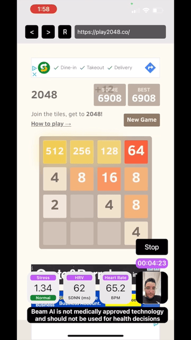
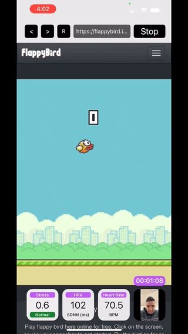

# Beam AI Browser (iOS)

This repository contains the source code for [Beam AI Browser](https://apps.apple.com/ua/app/beam-ai-browser/id1629793784) built using the [Beam AI SDK](https://github.com/beamai/BeamAISDK-iOS). With [Beam AI Browser](https://apps.apple.com/ua/app/beam-ai-browser/id1629793784), users can browse the web while monitoring their stress, heart rate and heart rate variability through the selfie camera in real-time. You can download [Beam AI Browser](https://apps.apple.com/ua/app/beam-ai-browser/id1629793784) from App Store.



## How Does It Work?

The core stress monitoring technology comes from the [Beam AI SDK](https://github.com/beamai/BeamAISDK-iOS) which enables iOS apps to monitor the user's heart rate, heart rate variability and stress through the selfie-camera. Our technology extracts the user’s pulse wave by analyzing subtle color variations across the skin regions of the user’s face. The user’s pulse is then used to determine stress, heart rate, and heart rate variability. To determine stress, we analyze the variability of the user's heartbeats according to the Baevsky Stress Index which has been shown to provide an accurate quantitative measure of physiological stress.

This is one of the two sample projects provided by [Beam AI](https://www.beamhealth.ai/). To test the core stress, heart rate and heart rate variability monitoring technology available in the [Beam AI SDK](https://github.com/beamai/BeamAISDK-iOS), see [Beam AI Lite](https://apps.apple.com/ua/app/beam-ai-lite/id1629758948). You can find [Beam AI Lite](https://apps.apple.com/ua/app/beam-ai-lite/id1629758948)'s source code [here on GitHub](https://github.com/beamai/BeamAILite-iOS).

## Setup & Run (in less than 15 minutes)

1. Clone this repository and open it up in Xcode.
2. Add the [Beam AI SDK](https://github.com/beamai/BeamAISDK-iOS) to the project inside Xcode. Simply click File > Add Packages. Then, look up https://github.com/beamai/BeamAISDK-iOS/ and click + to add the Beam AI SDK package to your project.
3. Update the beamID on line 58 of ViewController.swift. You will need a beamID to be able to use the Beam AI SDK. You can sign up to get your beamID [dashboard.beamhealth.ai](https://dashboard.beamhealth.ai/).

```
self.beamAI = try! BeamAI(beamID: "your-20-char-beamID", frameRate: 30, window: 60.0, updateEvery: 1.0)
```

4. Update app team to your App Store developer account, and deploy onto an iPhone device.
5. Enjoy the build and race to build the super cool application you are thinking about 😎! Note that the SDK works on iPhone and iPad devices, but not the Xcode simulators as those do not support camera access. You will therefore need to build and test this sample project on a physical iPhone device.

## Contact

For feature requests, questions and support, please open a GitHub issue. For all other inquiries, please email us directly at [contact@beamhealth.ai](contact@beamhealth.ai)!

Follow us on [LinkedIn](https://www.linkedin.com/company/beamhealthai/), [Instagram](https://www.instagram.com/beamhealthai/), [Twitter](https://twitter.com/BeamHealthAI) and [YouTube](https://www.youtube.com/channel/UCLhM9USQWe01OZoPOFvQ6sg/featured) to stay up-to-date with our latest news, updates and releases - and lots of fun demos and posts!
